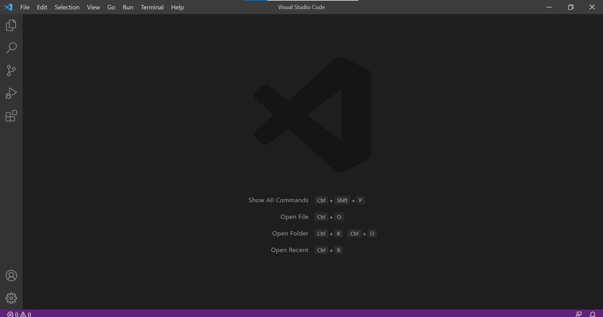
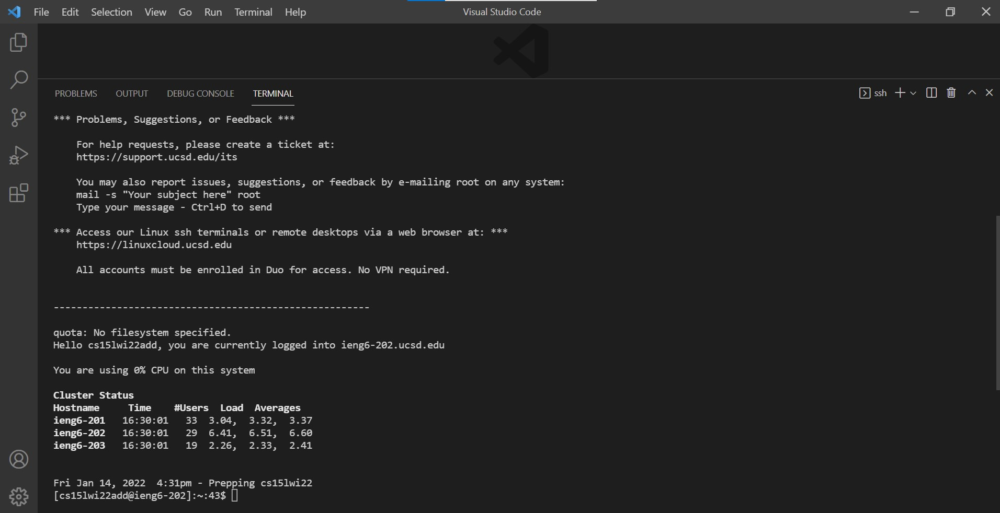
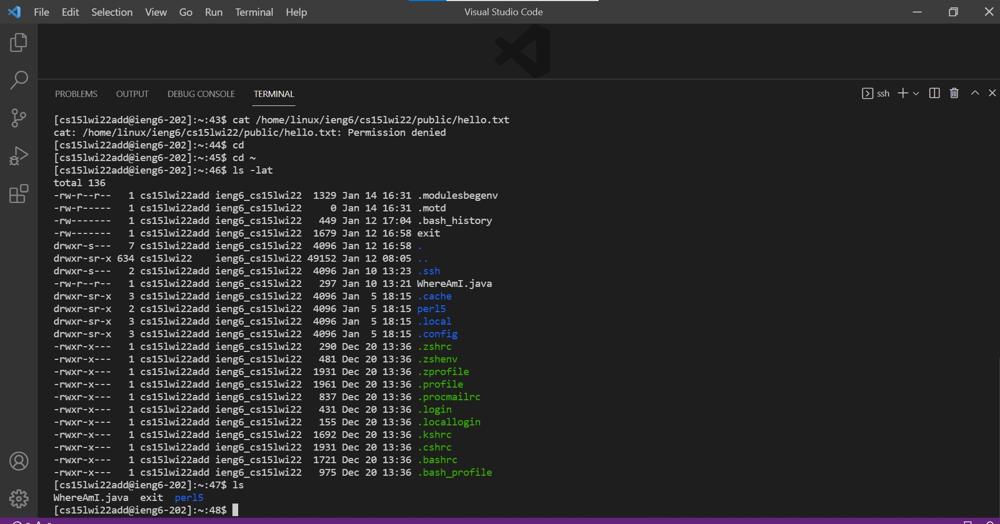
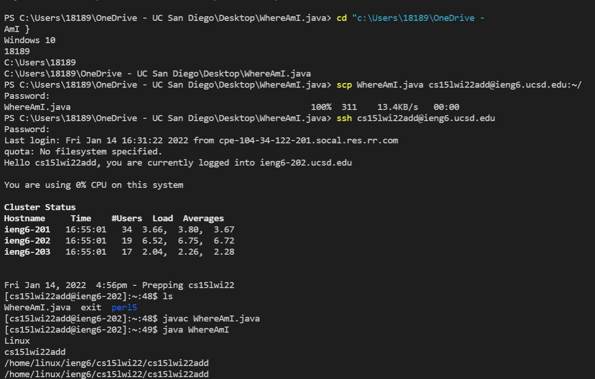
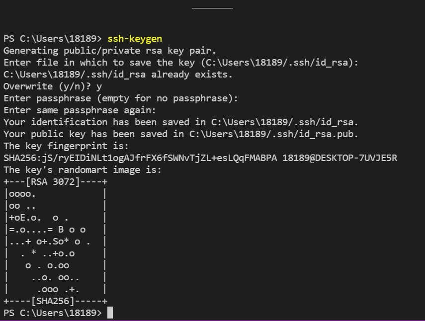
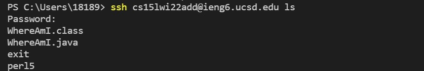

# **Logging Into Your ieng6 Account:** 

## **Installing VScode**
---

Use this link to access their website and follow instuctions given:
>[VScodeDownload](https://code.visualstudio.com/)

---

## **Remotely Connecting**
---
If you are on a windows device, you first need to download a program called OpenSSH for remote connecting to be possible
>[OpenSSHDownload](https://docs.microsoft.com/en-us/windows-server/administration/openssh/openssh_install_firstuse)

After, find your personal course-specific account for CSE 15L using this website
>[FindingYourACC](https://sdacs.ucsd.edu/~icc/index.php)

Once finding your account, open the terminal in VScode and type in this command
***replace 'zz' with your own id***
>$ ssh cs15lwi22zz@ieng6.ucsd.edu

It will then ask you a yes or no question whether or not to continue connecting

>respond with yes

Your screen should look like this

---
## **Trying Some Commands**
---

Now its time for some commands!

Here are some commands that might be fun to try
- cd ~
- cd
- ls -lat
- ls
- cp /home/linux/ieng6/cs15lwi22/public/hello.txt ~/
- cat /home/linux/ieng6/cs15lwi22/public/hello.txt
- ls </home/linux/ieng6/cs15lwi22/cs15lwi22abc>
>replace "abc" with your personal id

Once you are done with the commands, you can stop the connection by using/typing:
>Ctrl-D

>exit

Your terminal should look something like this:

---

## **Moving Files with scp**
---

The reason for remotely connecting using ssh is so that you can run files in a separate, more powerful computer
>use command ***scp*** to move files

Let's first create a file:
- Create a file on you computer called: *WhereAmI.java*
- put this in its contents:
>class WhereAmI {
  public static void main(String[] args) {
    System.out.println(System.getProperty("os.name"));
    System.out.println(System.getProperty("user.name"));
    System.out.println(System.getProperty("user.home"));
    System.out.println(System.getProperty("user.dir"));
  }
}

Next, run this command in the file's terminal
>scp WhereAmI.java csd15lwi22zz@ieng6.ucsd.edu:~
>*Make sure to replace **zz** with your personal id*

After login remotely using the steps above and type the command "ls"

This should the files you imported into the ieng6 computer and can now run javac and java on the ieng6 computer!

Your terminal should look something like this:

---
## **Setting an SSH Key**
---

It is annoying to always type in your password after running scp, so lets skip this step by setting up an SSH Key!

The steps to set an SSH Key:
- run a command: *$ssh-keygen*
- skip all the commands by pressing enter until you see the key's randomart image

>If you are on a windows device, follow the extra ssh-add command here: [ssh-add extra step](https://docs.microsoft.com/en-us/windows-server/administration/openssh/openssh_keymanagement#user-key-generation)

Your terminal should look like this:

Next, follow the commands:
> ssh cs15lwi22zz@ieng6.ucsd.edu

> Enter Password (*now on server*)

>mkdir .ssh

>logout (*back on client*)

>$ scp /Users/joe/.ssh/id_rsa.pub cs15lwi22@ieng6.ucsd.edu:~/.ssh/authorized_keys

> ^Use your username and the path you saw in the command above

Congratulations! You should now be able to use ssh or scp without entering your password.

---
## **Optimizing Remote Running**
---

Use the techniques below to save some time when using a remote server
- When using ssh, you can add a command at the end in quotations. This will run the command immediately after opening the server.
>$ ssh cs15lwi22zz@ieng6.ucsd.edu "ls"

- Semicolons can be used to run multiple commands on the same line
>$ scp WhereAmI.java WhereAmI.java; javac WhereAmI.java; java WhereAmI

Example Screenshot:
