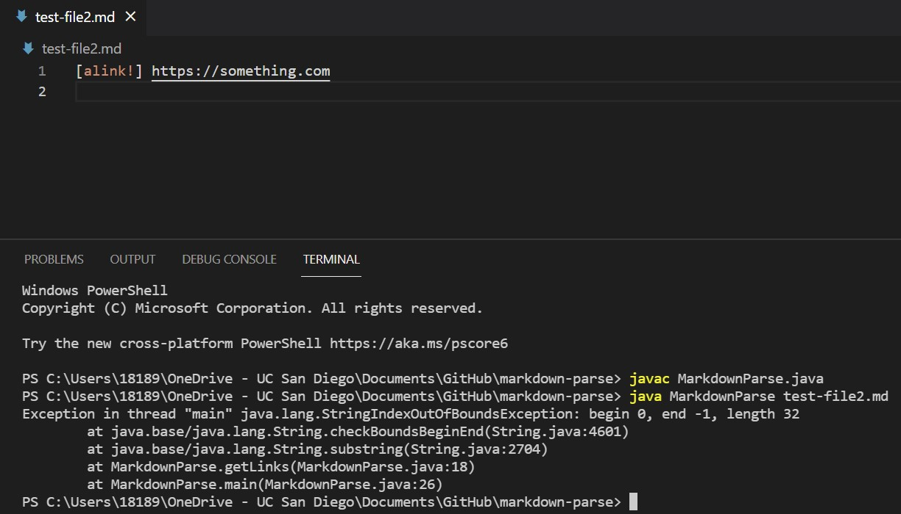
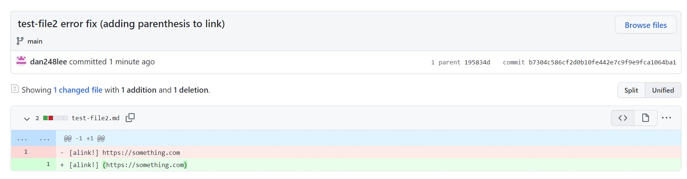
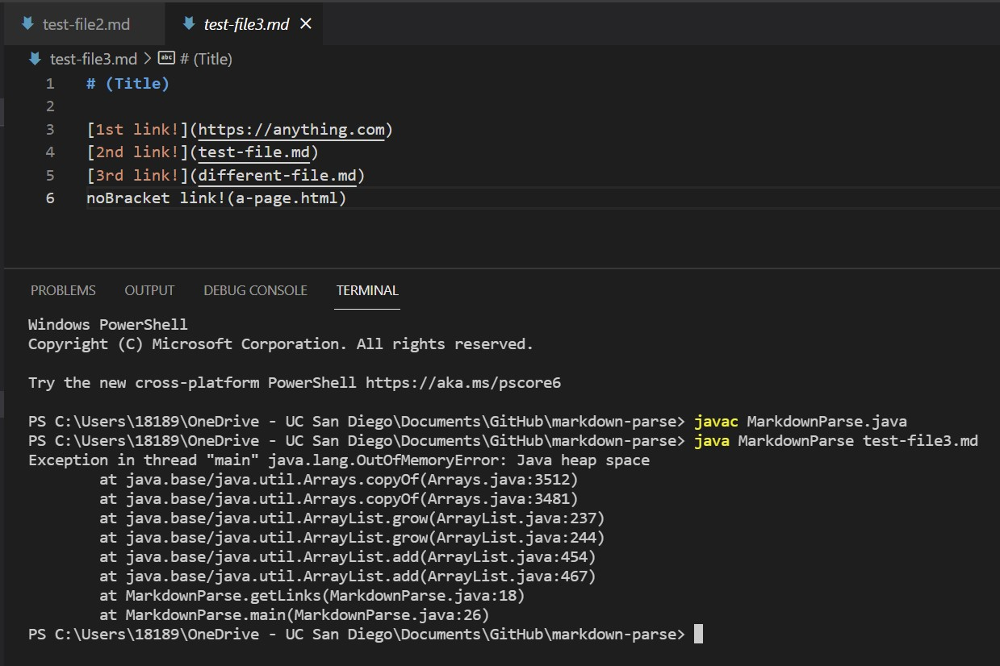
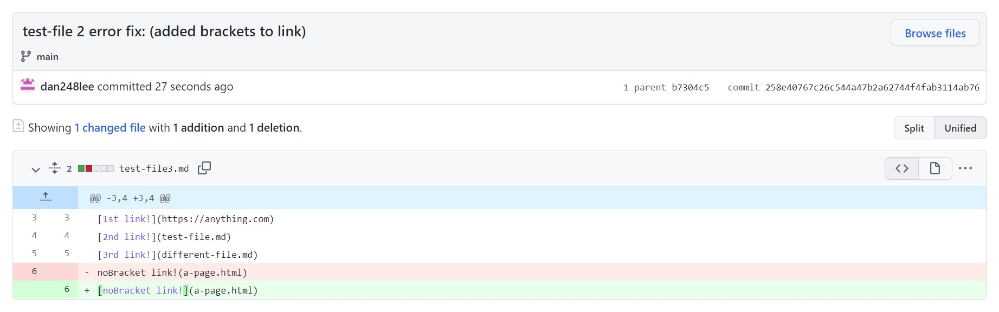
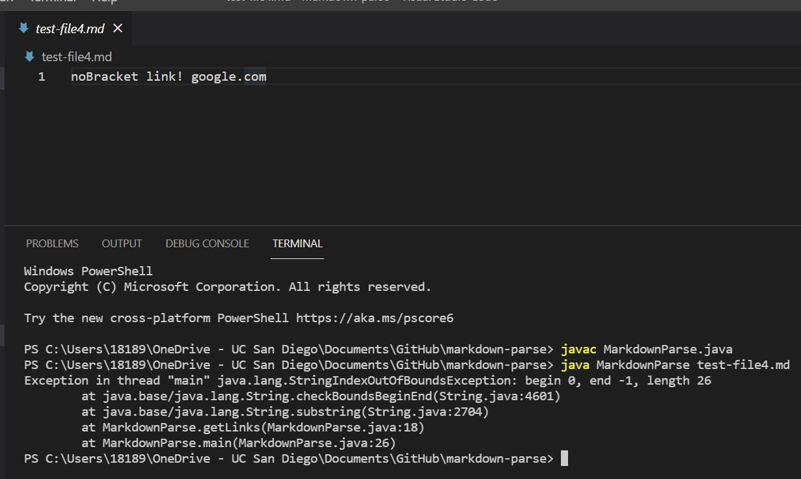
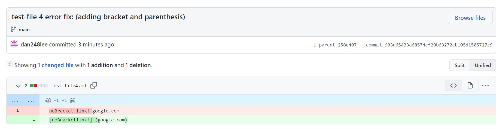

# Lab Report Week 4

## **Error One**

>The index out of bounds error came from the program being unable to find the link after the create-a-link function was called. This caused the program to call an out of bounds error since there was no link to print out on the output.

---

## **Error 2**

---

>The out of memory error came from the program continuously running until it ran out of memory. I believe this occured because the program was trying to find out what to do with the parenthesized link but was unable to find anything, creating an infinite loop. The fix was to add the [!] link function so that the parenthesized string could be converted to a link and ending the program.

---

## **Error 3**

---

>The error called was an index out of bounds error in the main method, which was probably called becasue of the lack of links for the program to take as an input. This caused the index to become out of bounds as the program ran, causing the error to occur. By adding brackets and parenthesis around the appropiate areas, this will give the program an input, causing no errors to occur.

---