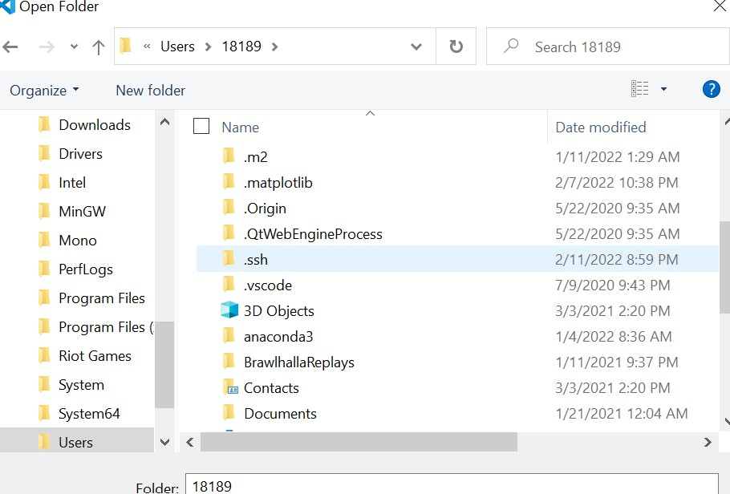
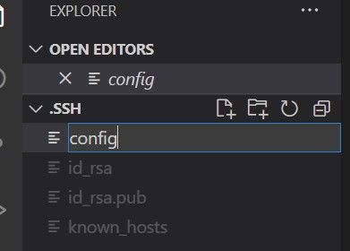
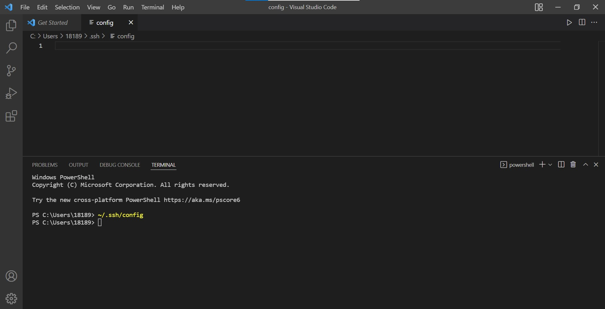
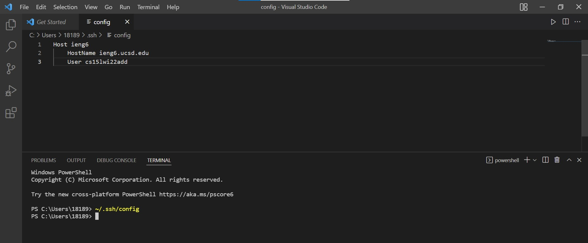
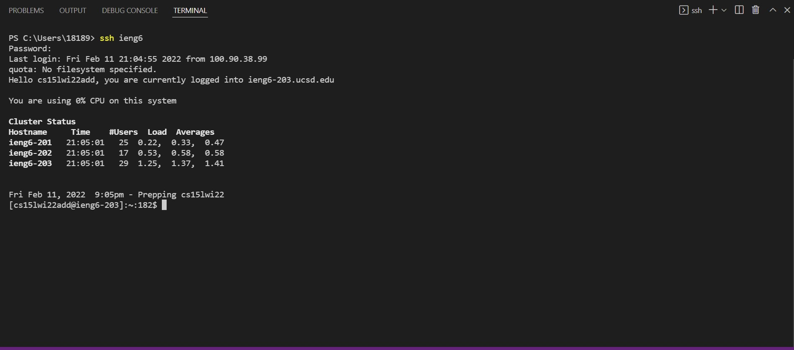
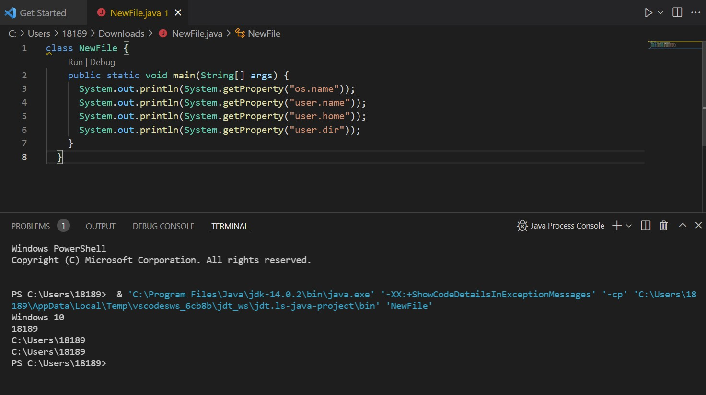
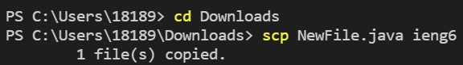

# Week 6 Lab Report

### Streamlining ssh Configuration
---

[link to index](https://dan248lee.github.io/cs15l-lab-reports/index)

>Access the .ssh folder inside your pc
>
>Then open the folder through vs code

---

>Create a new file called config inside the ssh folder

---

>Open the config file using ~./.ssh/config

---

>Then add the lines of code given:
>>Host ieng6
    HostName ieng6.ucsd.edu
    User cs15lwi22zzz (use your username)

---

>Then access your ssh with the code ssh ieng6
>Congratulations!!!
---

>Now using the shorter method of calling a remote engine, lets copy a file using scp

>Created a new file called newFile.java
---

>After copied the new file with the scp command, replacing the long username login with just ieng6