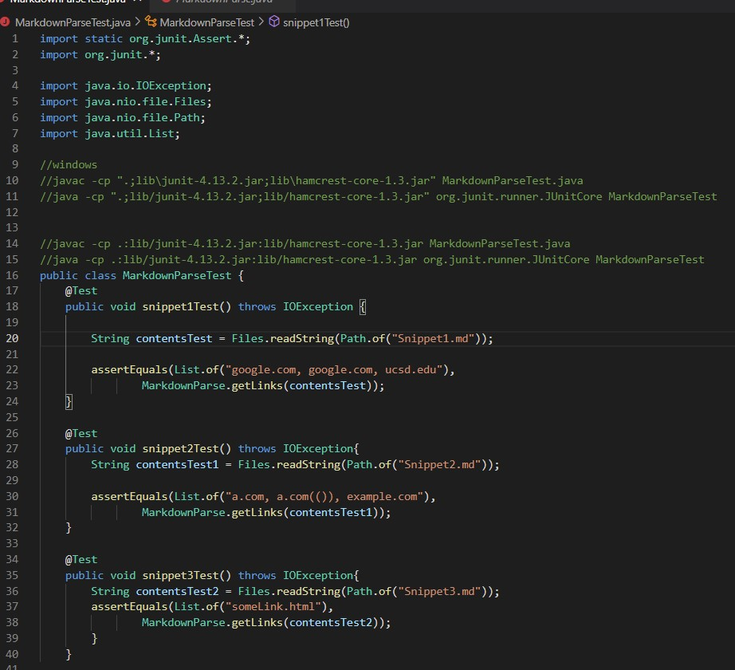
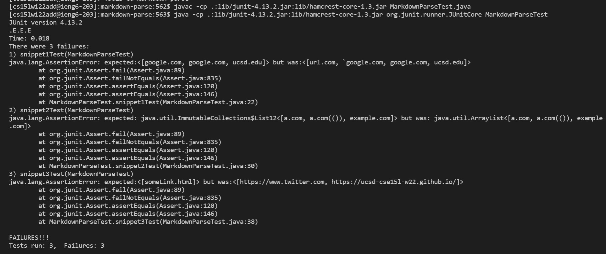
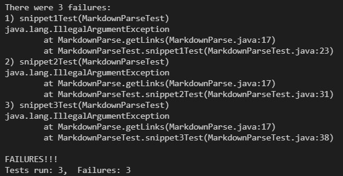

# Week 8 Lab Report

## **Test Created for the Two MarkdownParses**

---

## **Testing my own MarkdownParse**

---

### **Link:**
>[My personal MarkdownParse](https://github.com/dan248lee/markdown-parse)

---
## **Output of personal MarkdownParse**
---

---

### **Test 1** *(Snippet 1)*:
>Expected Production:
>> [google.com, google.com, ucsd.edu]
>
>Corresponding Output:
>>Results: Error. 

### **Test 2** *(Snippet 2)*:
>Expected Production:
>> [a.com, a.com(()), example.com]
>
>Corresponding Output:
>>Results: Error.

### **Test 3** *(Snippet 3)*:
>Expected Production:
>> [https://ucsd.cse15l-w22.github.io/]
>
>Corresponding Output:
>>Results: Error. 

---

## **Testing Week 7 MarkdownParse**
---

### Link:
>[MarkdownParse reviewed](https://github.com/5ean-github/markdown-parse.git)

---
## **Output of Week 7 MarkdownParse**

---

### **Test 1** (Snippet 1):
>Expected Production:
>> [google.com, google.com, ucsd.edu]
>
>Corresponding Output:
>>Results: Error.

### **Test 2** (Snippet 2):
>Expected Production:
>> [a.com, a.com(()), example.com]
>
>Corresponding Output:
>>Results: Error.

### **Test 3** (Snippet 3):
>Expected Production:
>> [https://ucsd.cse15l-w22.github.io/]
>
>Corresponding Output:
>>Results: Error.

---

# **Questions**

### **1. Do you think there is a small (<10 lines) code change that will make your program work for snippet 1 and all related cases that use inline code with backticks?**

> Yes. You would just need to code that the link is only valid if there are two backticks in the brackets. If there is not two then it will not be a valid link. You also have to make sure to remove backticks if inside the link.

### **2. Do you think there is a small (<10 lines) code change that will make your program work for snippet 2 and all related cases that nest parentheses, brackets, and escaped brackets?**

> No. A lot of coding would be required to account for all the miscellaneous characters that may appear inside nested parenthesis, brackets, and escaped brackets. Also more coding would be required to tell the program which nested bracket/parenthesis would have priority when getting the link.

### **3. Do you think there is a small (<10 lines) code change that will make your program work for snippet 3 and all related cases that have newlines in brackets and parentheses?**

> Yes. You would just have to code to make sure a link wont be printed out if the bracket has line breaks.