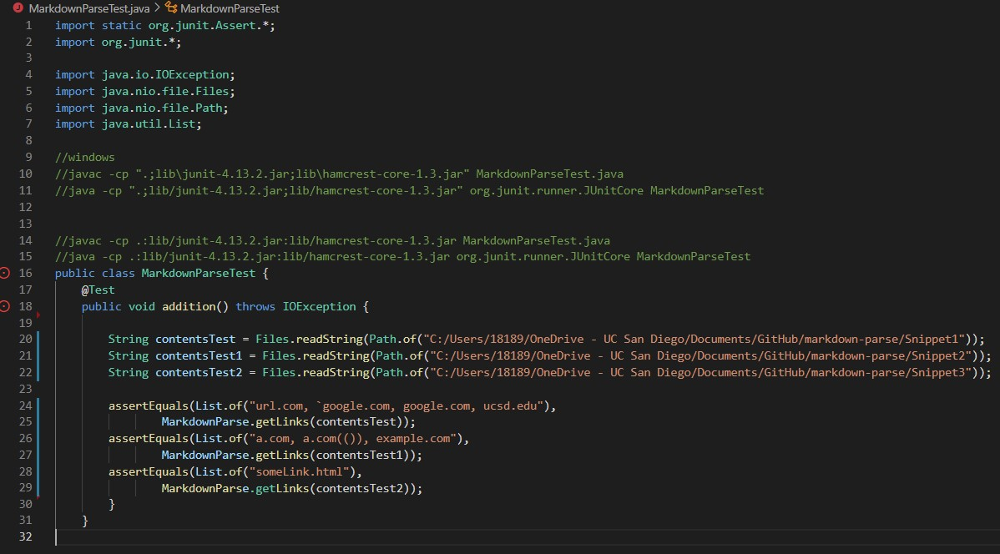

# Week 8 Lab Report

## **Testing my own MarkdownParse**

---

### **Link:**
>[My personal MarkdownParse](https://github.com/dan248lee/markdown-parse)

### **Test 1** *(Snippet 1)*:
>Expected Production:
>> [url.com, `google.com, google.com, ucsd.edu]
>
>Code in MarkdownParseTest.java:
>> 
>
>Corresponding Output:
>>Results: Error. 

### **Test 2** *(Snippet 2)*:
>Expected Production:
>> [a.com, a.com(()), example.com]
>
>Code in MarkdownParseTest.java
>> 
>
>Corresponding Output:
>>Results: Error.

### **Test 3** *(Snippet 3)*:
>Expected Production:
>>Error
>
>Code in MarkdownParseTest.java
>> 
>
>Corresponding Output:
>>Results: Error. 

---

## **Testing Week 7 MarkdownParse**
---

### Link:
>[Week 7 MarkdownParse](https://github.com/ucsd-cse15l-w22/markdown-parse/tree/2pm)

### **Test 1** (Snippet 1):
>Expected Production:
>> [url.com, `google.com, google.com, ucsd.edu]
>
>Code in MarkdownParseTest.java
>> 
>
>Corresponding Output:
>>Results: 

### **Test 2** (Snippet 2):
>Expected Production:
>> [a.com, a.com(()), example.com]
>
>Code in MarkdownParseTest.java
>> 
>
>Corresponding Output:
>>Results: 

### **Test 3** (Snippet 3):
>Expected Production:
>>Error
>
>Code in MarkdownParseTest.java
>> 
>
>Corresponding Output:
>>Results: 

---

# **Questions**

### **1. Do you think there is a small (<10 lines) code change that will make your program work for snippet 1 and all related cases that use inline code with backticks?**

> No. Code would be required for the program to ignore any brackets are parenthesis inside the brackets when naming the link. Then more coding would be required on ignoring backticks that may appear in the code.

### **2. Do you think there is a small (<10 lines) code change that will make your program work for snippet 2 and all related cases that nest parentheses, brackets, and escaped brackets?**

> No. A lot of coding would be required to account for all the miscellaneous characters that may appear inside nested parenthesis, brackets, and escaped brackets. Also more coding would be required to tell the program which nested bracket/parenthesis would have priority when getting the link.

### **3. Do you think there is a small (<10 lines) code change that will make your program work for snippet 3 and all related cases that have newlines in brackets and parentheses?**

> Yes. Since the program runs by searching for the next parenthesis or bracket, it would essentially ignore the new lines that are created if the readFile() method does not alter the text in any siginifcant way. Then, code would only have to be dedicated on fixing the missing parenthesis which would take <10 lines of code.