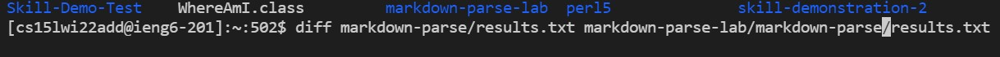
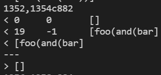
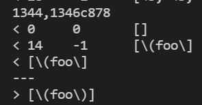

# Week 10 Lab Report 5

### **How you found the tests with different results?**

In order to find the tests I used the diff command to look at and see the differences of the two files.

No, I did not have to look for it manually or any other idea.

---

## **Test 1:**

This means that on line 1354 of the results.txt in the markdown-parse directory, the line contained 0 0 [], 19 -1 [foo(and(bar], and [foo(and(bar].

On line 882 of the markdown-parse-lab/markdown-parse/results.txt contained [].

---
## **Test 2:**

This means that on line 1346 of the results.txt in the markdown-parse directory, the line contained 0 0 [], 14 -1 [\(foo\], and [\(foo\]

On line 878 of the markdown-parse-lab/markdown-parse/results.txt contained [\(foo\)]